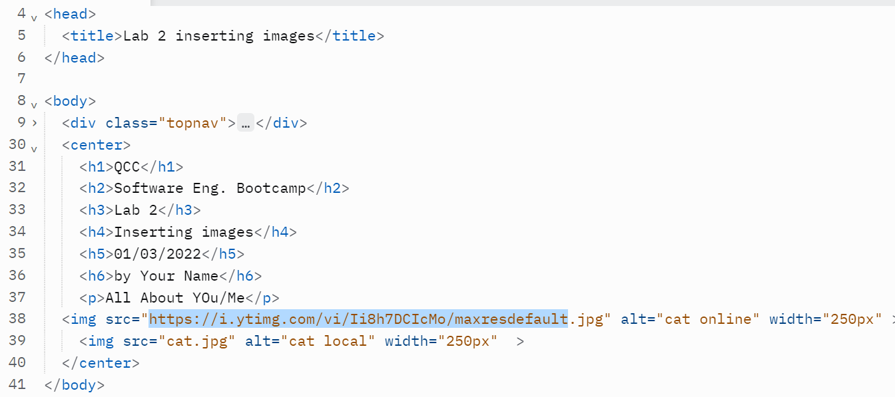

# Instructions  

  ## Steps
  1. Edit the index.html file 
  2. Add the code shown on the picture bellow.
  3. Find a picture of a cat or any animal you prefer.
  4. copy URL
  5. Download picture
  6. Insert into page

  For example, :

  
  
  